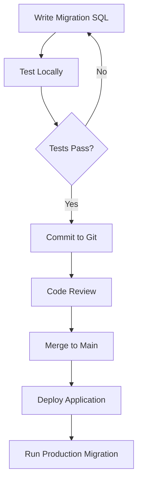

# Database Migration System

This document describes the database migration system for CryptDrive, designed to work with Cloudflare D1 databases.

## Overview

The migration system provides a reliable way to manage database schema changes over time. It tracks which migrations have been applied and ensures migrations are executed in the correct order.

## Architecture

### Components

1. **Migration Files** (`src/backend/db/migrations/*.sql`)
   - Individual SQL files containing schema changes
   - Named with sequential numbers: `001_initial_schema.sql`, `002_add_feature.sql`, etc.
   - Contains idempotent SQL statements when possible

2. **CLI Tool** (`src/backend/db/migrate-cli.js`)
   - Command-line interface for applying migrations
   - Works with both local and production databases
   - Provides status checking and migration application

### Migration Tracking Table

The system automatically creates a `migrations` table:

```sql
CREATE TABLE migrations (
    id INTEGER PRIMARY KEY AUTOINCREMENT,
    name TEXT NOT NULL UNIQUE,
    applied_at TEXT NOT NULL
);
```

This table keeps track of which migrations have been applied and when.

## Usage

The CLI tool provides the most control and is recommended for both development and production.

### Check migration status

```bash
# Local database
npm run migrate:status:local

# Production database
npm run migrate:status:prod
```

### Apply migrations

```bash
# Local database
npm run migrate:local

# Production database
npm run migrate:prod
```

The CLI will:

1. Show you which migrations are pending
2. Apply each migration in order
3. Record successful migrations in the database
4. Stop if any migration fails

## Creating New Migrations

### Step 1: Create Migration File

Create a new `.sql` file in `src/backend/db/migrations/` with the next sequential number:

```bash
# Example: Create migration 002
touch src/backend/db/migrations/002_add_subscription_tiers.sql
```

### Step 2: Write Migration SQL

Add your SQL statements with a descriptive header:

```sql
-- Migration: 002_add_subscription_tiers
-- Description: Add subscription tiers and user subscriptions tables
-- Created: 2026-03-07

CREATE TABLE IF NOT EXISTS foobar (...);
```

### Step 3: Test Locally

```bash
# Check what migrations are pending
npm run migrate:status:local

# Apply the migration
npm run migrate:local
```

### Step 4: Apply to Production

Once tested and verified:

```bash
npm run migrate:prod
```

## Best Practices

### 1. Make Migrations Idempotent

Use `IF NOT EXISTS`, `IF EXISTS`, etc. to make migrations safe to run multiple times:

```sql
-- Good: Safe to run multiple times
CREATE TABLE IF NOT EXISTS users (...);
CREATE INDEX IF NOT EXISTS idx_name ON users(name);

-- Bad: Will fail if run twice
CREATE TABLE users (...);
CREATE INDEX idx_name ON users(name);
```

### 2. Never Modify Existing Migrations

Once a migration is applied to production, never modify it. Create a new migration instead:

```sql
-- Don't modify 001_initial_schema.sql
-- Instead, create 002_fix_schema.sql:

ALTER TABLE users ADD COLUMN email TEXT;
```

### 3. Test Migrations Locally First

Always test migrations on your local development database before applying to production:

```bash
npm run migrate:local    # Test locally
npm run migrate:prod     # Apply to production
```

### 4. Keep Migrations Small and Focused

Each migration should represent one logical change:

```
✅ Good:
  - 002_add_subscription_tiers.sql
  - 003_add_user_preferences.sql
  - 004_add_audit_log.sql

❌ Bad:
  - 002_add_all_new_features.sql
```

### 5. Handle Data Migrations Carefully

When migrating data, consider splitting into multiple steps:

```sql
-- Step 1: Add new column with default
ALTER TABLE users ADD COLUMN status TEXT DEFAULT 'active';

-- Step 2 (separate migration): Backfill data if needed
UPDATE users SET status = 'inactive' WHERE last_login < '2025-01-01';

-- Step 3 (separate migration): Add NOT NULL constraint
-- (Only after ensuring all rows have values)
```

### 6. Document Breaking Changes

If a migration includes breaking changes, document them clearly:

```sql
-- Migration: 005_remove_deprecated_columns
-- Description: Removes deprecated columns from users table
--
-- BREAKING CHANGES:
-- - Removes 'old_field' column from users table
-- - Applications using 'old_field' must be updated first
--
-- Migration Plan:
-- 1. Deploy new code that doesn't use 'old_field'
-- 2. Wait 24 hours to ensure all instances updated
-- 3. Run this migration

ALTER TABLE users DROP COLUMN old_field;
```

## Cloudflare D1 Considerations

### Limitations

1. **No Transaction Support Across Statements**: D1 doesn't support multi-statement transactions via the HTTP API. Each SQL statement is executed separately.

2. **Statement Limits**: Each statement in D1 has limits on size and complexity. Keep statements reasonably sized.

3. **Async Execution**: D1 operations are asynchronous and are handled via the Wrangler CLI.

### Performance

- D1 migrations are generally fast for schema changes
- Large data migrations might take time - consider batching
- Indexes are built asynchronously in the background

### Backup Strategy

Before running migrations on production:

1. **Export Current Data**:

   ```bash
   npx wrangler d1 export cryptdrive --remote --output=backup.sql
   ```

2. **Test Migration**: Always test on local database first

3. **Apply Migration**: Run production migration

4. **Verify**: Check application functionality after migration

## Troubleshooting

### Migration Failed Halfway

If a migration fails:

1. Check the error message in the output
2. Fix the SQL in the migration file
3. Manually rollback changes if needed
4. Remove the failed migration record from the database:
   ```sql
   DELETE FROM migrations WHERE name = '00X_failed_migration';
   ```
5. Re-run the migration

### Migrations Out of Sync

If migrations are out of sync between environments:

```bash
# Check status in both environments
npm run migrate:status:local
npm run migrate:status:prod

# Apply missing migrations
npm run migrate:prod
```

### Need to Skip a Migration

If you need to mark a migration as applied without running it:

```bash
npx wrangler d1 execute cryptdrive --remote \
  --command="INSERT INTO migrations (name, applied_at) VALUES ('00X_migration_name', datetime('now'))"
```

**⚠️ Use with extreme caution!**

## Migration Workflow

### Development Workflow



### CI/CD Integration

For automated deployments, you can integrate migrations into your CI/CD pipeline:

```bash
#!/bin/bash
# deploy.sh

# Deploy the application
npm run deploy

# Wait for deployment
sleep 5

# Run migrations
npm run migrate:prod
```

Or run migrations as a separate step that requires manual approval.

## Security Considerations

### Migration File Security

- Never include sensitive data in migration files
- Review migrations carefully before applying to production
- Restrict access to production databases via Wrangler authentication
- Use version control to track who created which migrations

### Production Database Access

Production database migrations should be:

1. **Review Required**: All migrations should be reviewed before applying
2. **Tested First**: Always test on local database before production
3. **Backed Up**: Export production data before major migrations
4. **Logged**: Keep audit trail of who ran migrations and when
5. **Restricted**: Limit who has access to run `npm run migrate:prod`

## Summary

The migration system provides a robust way to manage database schema evolution:

- ✅ **Track** which migrations have been applied
- ✅ **Apply** migrations in order automatically
- ✅ **Prevent** duplicate applications
- ✅ **CLI-based** for safe, explicit control
- ✅ **Work** with Cloudflare D1's constraints

Use the CLI tool (`npm run migrate:local` or `npm run migrate:prod`) to manage all database migrations.
